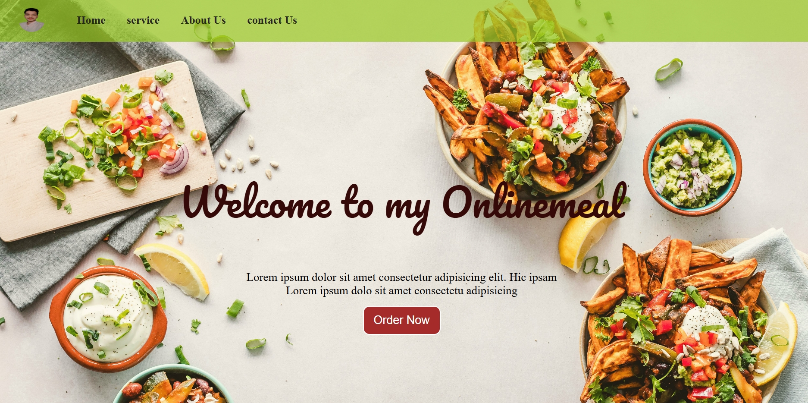

# 🍽️ Food OnlineMeal

Welcome to **Food OnlineMeal** – a modern and responsive food ordering website.

---

## 🚀 About the Project

Food OnlineMeal is a simple and stylish web project that showcases an online food ordering landing page with a clean UI and attractive design.

---

## ✨ Features

* 🍔 Attractive food-themed homepage
* 🧭 Navigation bar (Home, Service, About Us, Contact Us)
* 🛒 "Order Now" button
* 📱 Fully responsive layout
* 🎨 Modern UI design

---

## 📸 Website Preview



---

## 🛠️ Technologies Used

* HTML5
* CSS3
* JavaScript

---

## 📂 Project Structure

```
Food-OnlineMeal/
│── index.html
│── style.css
│── script.js
│── assets/
│    └── food-onlinemeal-preview.png
```

---

## 👨‍💻 Author

**Created by Harst Raj**

---

## 📌 How to Use

1. Clone the repository:

   ```bash
   git clone https://github.com/your-username/food-onlinemeal.git
   ```

2. Open the project folder:

   ```bash
   cd food-onlinemeal
   ```

3. Run the project:

   * Open `index.html` in your browser


* `assets` folder ke andar daalo
  ![alt text]foofbackgroundimg.png
  
food-onlinemeal-preview.png
```

---

## 🌟 Future Improvements

* Backend integration
* Online food ordering system
* Payment gateway
* Login / Signup system

---

💡 *Feel free to fork, use, and improve this project!*
